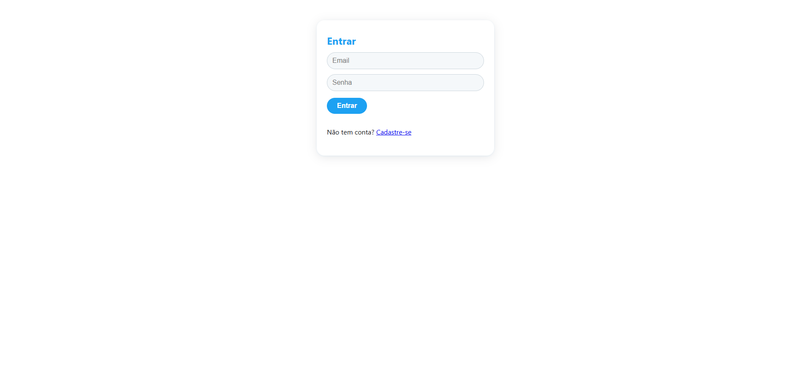
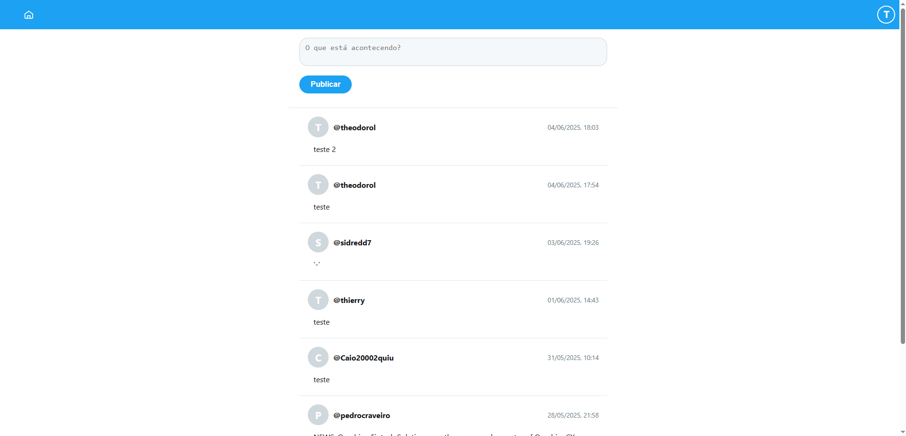
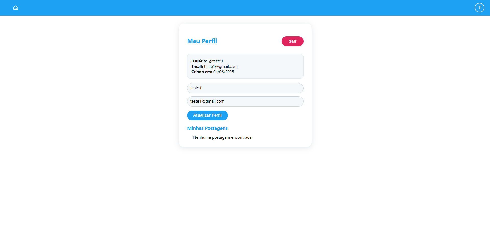

# Mini Twitter

    Uma versão simplificada do Twitter feita com HTML, CSS e JavaScript puro, consumindo uma API REST.

## Funcionalidades
    - Cadastro e login de usuários
    - Feed de postagens (criar, listar, deletar)
    - Visualização e edição de perfil
    - Responsivo (mobile-first)
    - Persistência de autenticação via localStorage

## Como rodar
    1. Baixe/clique duas vezes no arquivo `index.html` (não precisa de servidor).
    2. Crie uma conta ou faça login.
    3. Use o feed, publique, edite seu perfil!

## Estrutura da Pastas
```
mini-twitter/
├── index.html
├── css/
│   ├── style.css
│   └── reset.css
├── js/
│   ├── controllers/
│   ├── views/
│   └── repositories/
└── assets/
    └── images/
```

## API
A aplicação consome a API pública: https://mini-twitter-api-vy9q.onrender.com/

## Prints

### Login 


### Feed


### Perfil

